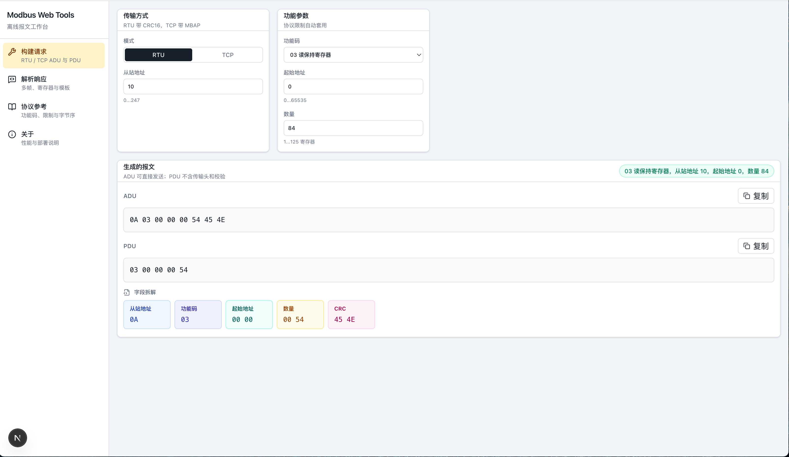
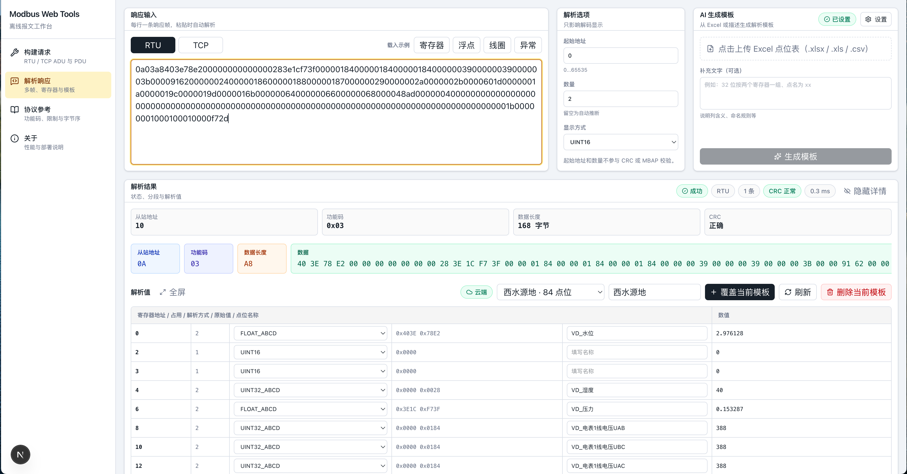

# Modbus Web Tools

[ModbusWorkbench](https://github.com/minivv/ModbusWorkbench) 的 Web 版本：无需打开串口或建立 TCP 连接，在浏览器里离线完成 **Modbus RTU / TCP 报文构建**与**响应解析**。基于 Next.js，解析在 Web Worker 中执行，长报文输入不阻塞界面。

## 截图





## 功能

- **报文构建**：覆盖 01/02/03/04/05/06/15/16 八个常用功能码；RTU 自动附加 CRC16，TCP 附带 MBAP 头；按协议自动套用数量限制。
- **响应解析**：支持多帧粘贴自动分帧；CRC / MBAP 长度校验、异常码解释、字段级分段着色。
- **线圈 / 离散输入**：以开关状态灯（灰=关、绿=开）横向展示每个 bit。
- **寄存器解码**：UINT16 / INT16 / UINT32 / INT32 / FLOAT / UINT64 / INT64 / DOUBLE，含 ABCD / CDAB / BADC / DCBA（含 64 位变体）字节序。
- **多帧对比**：寄存器值逐列对比；每点可单独切换解析方式、填写点位名称。
- **解析模板**：把点位名称 + 解析方式存为模板，保存在 Supabase（最多 24 个），支持云端 / 本地缓存双通道。
- **AI 生成模板**（基于 Vercel AI SDK）：粘贴一段文字或直接上传 Excel（如 MCGS 组态导出的通道表），自动生成寄存器地址、点位名称与解析方式；服务端地址 / Key / 模型均可自定义，内置 DeepSeek 预设并兼容其推理模型（`reasoning_content`）输出。

## 技术栈

- Next.js 15（App Router，TypeScript）
- Tailwind CSS 4 + lucide-react
- Vercel AI SDK（`ai` + `@ai-sdk/openai`）+ SheetJS（读取 xlsx）
- Supabase（模板持久化）
- Web Worker（离线解析，不占用主线程）

## 本地开发

```bash
npm install
cp .env.example .env.local
npm run dev
```

打开 http://localhost:3000。

### 环境变量

| 变量 | 说明 |
| --- | --- |
| `NEXT_PUBLIC_SUPABASE_URL` | Supabase 项目地址（解析模板存储） |
| `NEXT_PUBLIC_SUPABASE_ANON_KEY` | Supabase anon/public key（账号注册登录用） |
| `SUPABASE_SERVICE_ROLE_KEY` | Supabase 服务端密钥（仅服务端使用） |

先在 Supabase SQL Editor 执行 `supabase/schema.sql` 建表，再执行 `supabase/migration-user-presets.sql` 增加模板的账号归属列。模板接口不可用时自动降级为浏览器本地缓存，工具仍可离线使用。

### 账号与模板

- 侧栏提供 **登录 / 注册**（Supabase Auth，默认开放注册）；未登录时模板仅保存在本机浏览器。
- 登录后解析模板保存到**当前账号**，不同账号之间互不可见；每个账号最多 24 个模板。

AI 生成模板的 Base URL / Key / 模型在页面上配置，仅保存在浏览器本地，请求由页面直连模型服务（默认适配 DeepSeek）。

## 部署到 Vercel

```bash
npx vercel
```

在 Vercel 项目设置中配置上述三个环境变量（账号与云端模板必需）；未配置时工具自动使用本地缓存。

## 目录

```
src/
├── app/                 # Next.js 路由与模板 API
├── components/          # UI（构建器 / 解析器 / 模板面板 / AI 模板卡）
├── lib/                 # CRC、编解码、分段、AI 模板解析等
└── workers/             # 解析 Web Worker
```

## 说明

- 本项目为离线工具，不做串口/TCP 直连；请在目标设备或网关侧抓包后粘贴报文使用。
- 本作品收录于 [WeiSpot](https://weispot.vercel.app) 作品集：<https://weispot.vercel.app/projects/modbus-web-tools>。
